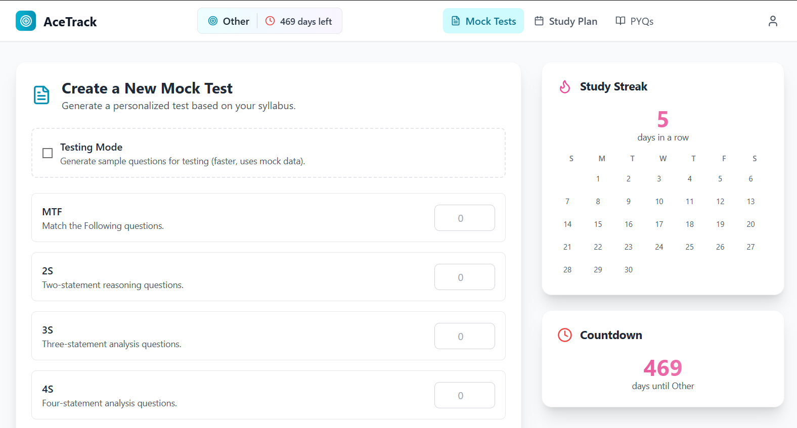

# AceTrack 🚀

**AI-Powered Study Planner & Mock Test Generator**

**AceTrack** is a full-stack, AI-powered educational productivity platform designed to help students prepare for competitive exams such as **UPSC, GATE, JEE (Mains/Advanced), NEET, and UGC NET**.

The platform leverages **Large Language Models (LLMs)** to transform raw syllabus data into **structured mock tests** and **personalized study plans**, bridging the gap between static study material and active, exam-oriented practice.



---

## 🌐 Live Deployment

* **Frontend:** [https://ace-track.vercel.app/](https://ace-track.vercel.app/)
* **Backend API:** [https://acetrack-backend.onrender.com/](https://acetrack-backend.onrender.com/)

---

## ✨ Key Features

### 🔐 Authentication & User Management

* Secure user registration and login using **JWT-based authentication**
* Persistent user sessions and protected routes

### 🎯 Personalized Onboarding

* Guided first-time onboarding to capture:

  * Target exam
  * Tentative exam date
* Dynamically personalizes the dashboard and countdown timers

### 🧠 AI-Powered Mock Test Generator

The core feature of AceTrack.

* **Multi-Format Questions:**
  Supports 10+ formats including:

  * MCQs
  * Match the Following
  * Assertion–Reason
  * Statement-Based
* **Custom Length Control:**
  Specify the exact number of questions per format
* **Syllabus-Aware Generation:**
  Questions are generated strictly from uploaded syllabus data
* **Dynamic File Export:**
  Mock tests are delivered as clean, printable **PDF files** or **DOCX files** as per the user's choice
* **Persistent Storage:**
  Generated tests are securely stored using **Cloudinary**

### 📘 Dynamic Syllabus Management

* Upload syllabus files in `.xlsx` format
* Automatic topic extraction and structuring
* Eliminates hardcoded syllabus data

### 🗂️ Study Plan Caching & Cost Optimization

* Hybrid database strategy to cache AI outputs
* Reduces repeated API calls and improves response time
* Lays groundwork for future fine-tuning and analytics

### 🖥️ Modern, Responsive UI

* Tabbed dashboard for:

  * Mock Test Generator
  * Study Plan Calendar
  * Syllabus
* Live exam countdown in header
* Sidebar widgets:

  * Study streak tracking
  * Exam countdown visualization

---

## 🏗️ Technical Architecture

AceTrack follows a **decoupled, containerized architecture** designed for scalability, maintainability, and cloud deployment.

### Tech Stack

| Layer              | Technology                            |
| ------------------ | ------------------------------------- |
| Frontend           | React, TypeScript, Vite, Tailwind CSS |
| Backend            | Python, FastAPI                       |
| Primary DB         | PostgreSQL (Aiven)                    |
| Logging / AI Cache | MongoDB (Atlas)                       |
| ORM                | SQLAlchemy                            |
| AI Engine          | OpenAI API (GPT-4o)                   |
| File Storage       | Cloudinary                            |
| Infrastructure     | Docker & Docker Compose               |
| Deployment         | Vercel (Frontend), Render (Backend)   |

---

## 📂 Project Structure

```text
STUDYPLANNERAPP/
├── backend/                # FastAPI backend
│   ├── services/           # Core AI & business logic
│   │   ├── Generation.py       # Mock test generation logic
│   │   └── PromptsDict.py      # Centralized prompt management
│   ├── auth.py             # JWT authentication
│   ├── crud.py             # Database CRUD operations
│   ├── database.py         # SQLAlchemy setup
│   ├── main.py             # FastAPI entry point & routes
│   ├── models.py           # Database models
│   ├── schemas.py          # Pydantic schemas
│   ├── Dockerfile          # Backend containerization
│   └── requirements.txt
│
├── frontend/               # React frontend
│   ├── src/
│   │   ├── components/
│   │   │   ├── Dashboard.tsx
│   │   │   ├── LoginPage.tsx
│   │   │   ├── SignupPage.tsx
│   │   │   ├── OnboardingPage.tsx
│   │   │   └── SyllabusPage.tsx
│   │   ├── App.tsx                 # Main application component with routing
│   │   └── main.tsx                # Application entry point
│   ├── index.html              # Main HTML file for the React app
│   ├── tailwind.config.js      # Configuration for Tailwind CSS
│   ├── package.json            # Project metadata and npm dependencies
│   ├── vite.config.ts          # Configuration for the Vite build tool
│   └── vercel.json             # Deployment configuration
│
├── docker-compose.yml      # Multi-container orchestration
└── .env                    # Environment variables
```

---

## 🛠️ Installation & Local Setup (Docker-Based)

### Prerequisites

* Docker & Docker Compose
* OpenAI API key
* PostgreSQL & MongoDB connection URLs

### Steps

1. **Clone the repository**

```bash
git clone https://github.com/Adit1414/AceTrack.git
cd AceTrack
```

2. **Configure Environment Variables**

Create a `.env` file in the root directory:

```env
DATABASE_URL=your_postgresql_url
MONGO_URI=your_mongodb_url
OPENAI_API_KEY=your_openai_api_key
CLOUDINARY_URL=your_cloudinary_url
```

3. **Start the application**

```bash
docker-compose up --build
```

4. **Access**

* Frontend: [http://localhost:5173](http://localhost:5173)
* Backend: [http://localhost:10000](http://localhost:10000)

---

## 🚀 Deployment

AceTrack is production-ready and deployed using modern cloud platforms:

* **Frontend:** Vercel (automatic GitHub deployments)
* **Backend:** Render (Dockerized web service)
* **Databases:**

  * PostgreSQL on Aiven
  * MongoDB on Atlas
* **Uptime Management:**
  Cron-based health checks to prevent free-tier spin-down

---

## 🧭 Future Roadmap

Planned enhancements:

* **Dynamic AI Study Planner**

  * Adaptive daily schedules based on:

    * Available study hours
    * Weak subjects
    * Syllabus weightage
* **Chapter-Wise & Weightage-Based Tests**
* **Advanced Question Controls**

  * Cognitive level (factual, analytical, application-based)
* **In-App Test Taking Platform**

  * Timer-based exam simulation
  * Auto-evaluation & scoring
* **Performance Analytics Dashboard**
* **Resource Hub**

  * PYQs
  * Syllabus weightage trends
* **Monetization Layer**

  * Premium plans for advanced features

---

## 📝 License

Distributed under the **MIT License**.


