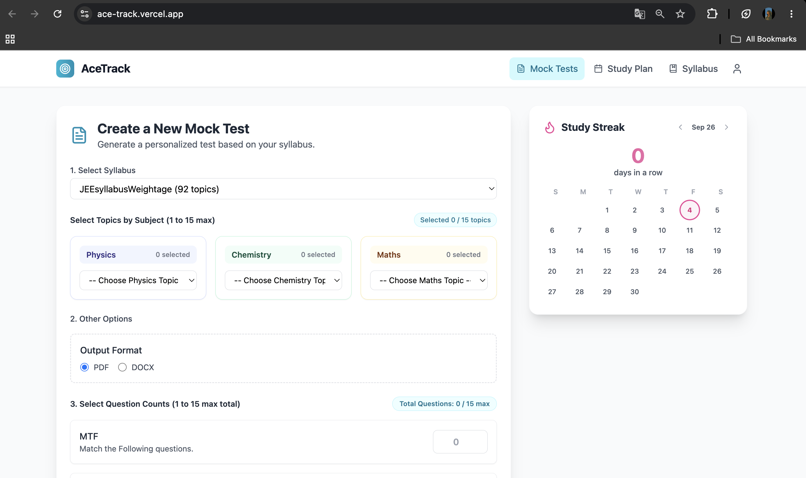

# AceTrack 🚀

### AI-Powered Mock Test Generator & Personalized Study Planner

**AceTrack** is an AI-powered learning platform designed to make exam preparation more personalized, structured, and consistent.

It combines **syllabus-based mock test generation, AI-powered evaluation and feedback, personalized study planning, and progress tracking** in one platform.

---

The platform leverages **Large Language Models (LLMs)** to transform raw syllabus data into **structured mock tests** and **personalized study plans**, bridging the gap between static study material and active, exam-oriented practice.



---

## 🌐 DEPLOYMENT LINK

[https://ace-track.vercel.app/](https://ace-track.vercel.app/)

---

## ✨ Key Features

### 🧠 AI Mock Test Generator

- Generate tests directly from an uploaded syllabus
- Select subjects and topics
- Choose question types
- Set the number of questions for each format
- Supports multiple formats including:
  - MCQ
  - Match the Following
  - Assertion & Reasoning
  - Statement-based questions
  - Case Studies
  - Numerical Answer Type
  - Chronological Ordering
- Attempt tests directly in the application

### 📊 AI Evaluation & Personalized Feedback

After completing a test, AceTrack provides:

- Overall score
- Student's selected answer
- Correct answer
- Explanation for each question
- Strengths and weak areas
- Personalized improvement feedback
- Recommended learning resources

### 📅 Personalized Study Planner

Students provide:

- Target exam
- Exam date
- Daily available study hours
- Days available per week
- Topics already completed

AceTrack then creates a **day-by-day study schedule** based on:

- Remaining syllabus
- Available preparation time
- Topic priority and weightage

The planner also supports **rebalancing and regeneration** when the student's schedule changes.

### 🔥 Progress Tracking & Gamification

- Mark daily study tasks as completed
- Track study progress
- Calendar-based schedule
- Study streak system to encourage consistency

### 📘 Dynamic Syllabus Management

- Upload syllabus using `.xlsx` files
- Automatically extract subjects and topics
- Mock tests and study plans adapt to the selected syllabus
- No exam-specific syllabus needs to be hardcoded

### 📄 Test Export

Generated mock tests can be exported as:

- PDF
- DOCX

Generated documents can be stored using cloud storage.

---

## 🔄 Workflow

```text
Upload / Select Syllabus
        ↓
Choose Topics + Question Types + Question Count
        ↓
Generate Mock Test
        ↓
Attempt Test
        ↓
AI Evaluation + Score + Explanations
        ↓
Personalized Feedback & Resources
        ↓
Generate Study Plan
        ↓
Track Daily Progress & Study Streak
```

---

## 🏗️ Tech Stack

| Layer | Technology |
|---|---|
| Frontend | React.js, TypeScript, Vite, Tailwind CSS |
| Backend | FastAPI, Python |
| Database | PostgreSQL |
| AI Layer | OpenAI API / LLM |
| Validation | Pydantic |
| ORM | SQLAlchemy |
| Document Generation | ReportLab, python-docx |
| File Storage | Cloudinary |
| Containerization | Docker |
| Frontend Deployment | Vercel |
| Backend Deployment | Render |

---

## 📂 Project Structure

```text
AceTrack/
│
├── backend/
│   ├── data/
│   ├── services/
│   │   ├── mocktest/
│   │   └── studyPlanner/
│   ├── utils/
│   ├── auth.py
│   ├── crud.py
│   ├── database.py
│   ├── main.py
│   ├── models.py
│   ├── schemas.py
│   ├── Dockerfile
│   └── requirements.txt
│
├── frontend/
│   ├── src/
│   │   ├── components/
│   │   ├── types/
│   │   ├── App.tsx
│   │   ├── config.ts
│   │   └── main.tsx
│   ├── package.json
│   ├── vite.config.ts
│   └── vercel.json
│
├── docker-compose.yml
└── README.md
```

---

## 🛠️ Local Setup

### 1. Clone the Repository

```bash
git clone https://github.com/Pragyasingh001/AceTrack.git
cd AceTrack
```

---

### 2. Backend Setup

```bash
cd backend
python3 -m venv venv
source venv/bin/activate
pip install -r requirements.txt
```

Create a `.env` file inside `backend/`:

```env
DATABASE_URL=your_postgresql_url
OPENAI_API_KEY=your_openai_api_key
SECRET_KEY=your_secret_key
MONGO_URI=your_mongodb_url
CLOUDINARY_URL=your_cloudinary_url
```

Run the backend:

```bash
uvicorn main:app --reload --port 10000
```

Backend will run at:

```text
http://localhost:10000
```

API documentation:

```text
http://localhost:10000/docs
```

---

### 3. Frontend Setup

Open another terminal:

```bash
cd frontend
npm install
npm run dev
```

Frontend will run at:

```text
http://localhost:5173
```

---

## 🐳 Docker Setup

From the project root:

```bash
docker-compose up --build
```

---

## 🚀 Deployment Architecture

```text
React + TypeScript Frontend
          ↓
        Vercel
          ↓
     FastAPI REST API
          ↓
    Docker on Render
          ↓
      PostgreSQL
```

AI-powered question generation, evaluation, feedback, and recommendations are handled through the LLM layer.

---

## 🔮 Future Scope

- **Open-Source Model Fine-Tuning:** Fine-tune models such as Llama or DeepSeek for subject-specific question generation and evaluation
- **RAG-Based Evaluation:** Ground explanations and feedback using trusted books and Previous Year Questions
- **Adaptive Test Engine:** Dynamically adjust question difficulty based on student performance
- **Predictive Analytics:** Estimate topic mastery, preparation readiness, and weak areas
- **Advanced Performance Dashboard:** Track accuracy and topic-wise improvement over time

---

## 🎯 Vision

> **AceTrack aims to bring practice, evaluation, planning, and consistency into one personalized exam-preparation platform.**

---

## 📝 License

This project is distributed under the MIT License.
